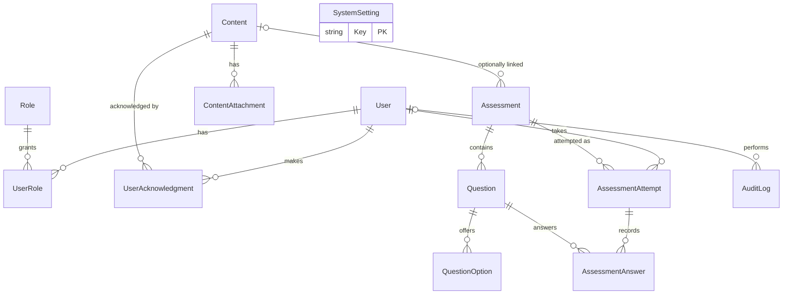

# Database (PostgreSQL + EF Core)

Migrations live in `src/CyberLms.Web/Data/Migrations` and are applied automatically at startup
(`Database:AutoMigrate`, default `true`; set to `false` and run `dotnet ef database update` / a migration bundle if your DBA prefers).

## ERD

## Tables

| Table | Purpose / notes |
|---|---|
| `Users` | Application identity. `Username` (unique, case-insensitive via `NormalizedUsername`), `PasswordHash` (null for AD accounts), `ExternalId` + `AuthSource` (`Local`/`Windows`) keep authentication separate from the user record. Lockout counters. |
| `Roles`, `UserRoles` | Roles are rows (`Admin`, `User` seeded). Add roles later without schema change. |
| `Contents` | Title, description, sanitized HTML body, `Type`, `Status` (Draft/Published), `RequiresAcknowledgment`, `Version` (reserved for future re-acknowledgment), external link. |
| `ContentAttachments` | File *metadata only*: original name, `StoredPath` (relative to the storage root), MIME type, size, kind. Binary lives on disk. |
| `UserAcknowledgments` | One row per (User, Content, ContentVersion) - **unique index** prevents duplicates. Admin "reset" deletes the row and writes an audit entry. |
| `Assessments` | Title, optional `ContentId`, `PassingPercentage` (CHECK 0-100), `MaxAttempts` (0 = unlimited), `IsPublished`. |
| `Questions`, `QuestionOptions` | Single choice / True-False / Multiple choice, points, order, correct flags. True/False options are stored as the keys `True`/`False` and shown in the UI language. |
| `AssessmentAttempts` | One row per attempt: start/finish, totals, score, percentage, `Passed`, and a **snapshot of the passing percentage**. Never overwritten; results are not stored on `Users`. |
| `AssessmentAnswers` | Per attempt/question: selected option ids (`int[]`), correctness, points. Unique (Attempt, Question). Question deletion is restricted once answers exist (and the UI locks questions once attempts exist). |
| `AuditLogs` | Time, admin id/username, action, entity, details, IP. |
| `SystemSettings` | Key/value: branding (`Branding.*`), SMTP (`Smtp.*` except password), general (`App.BaseUrl`, `General.DefaultLanguage`). |

## Reporting semantics

"Employees" = active users holding the `User` role. A user's assessment status is **Passed** if any completed attempt passed, otherwise **Failed** if any attempt completed, otherwise **Not attempted**. Acknowledgment status compares against the content's current `Version`.

## Indexes of note
`Users(NormalizedUsername)` unique, `UserAcknowledgments(UserId, ContentId, ContentVersion)` unique, `AssessmentAttempts(AssessmentId, UserId)`, `AuditLogs(Timestamp)`, `Contents(Status, Type)`.

## Sizing
5,000 users x a handful of assessments/policies is a few hundred thousand rows at most; a single PostgreSQL instance with default settings is ample.
